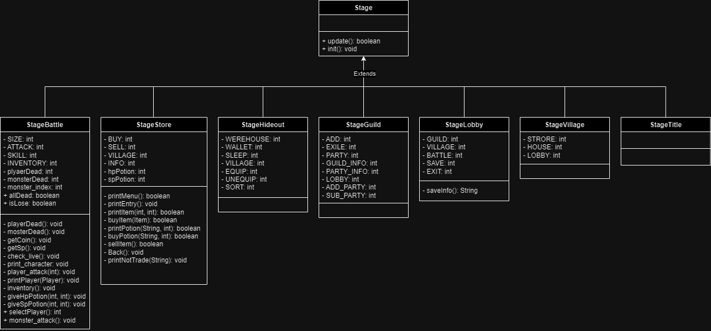
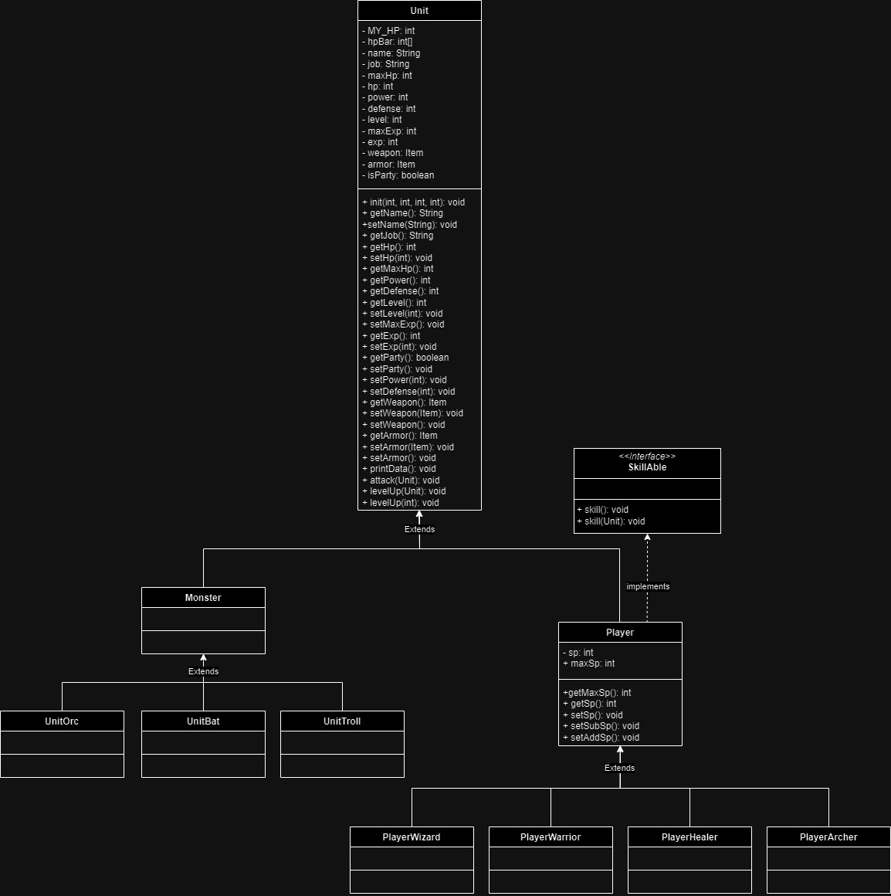
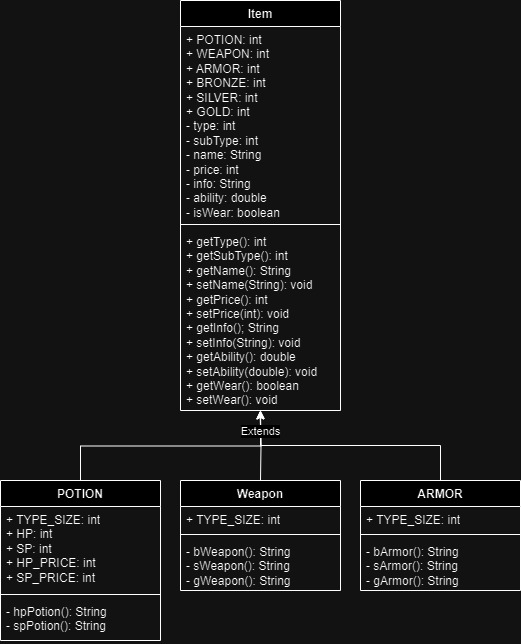
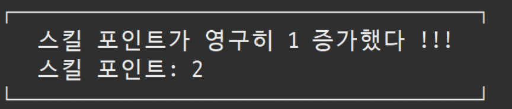
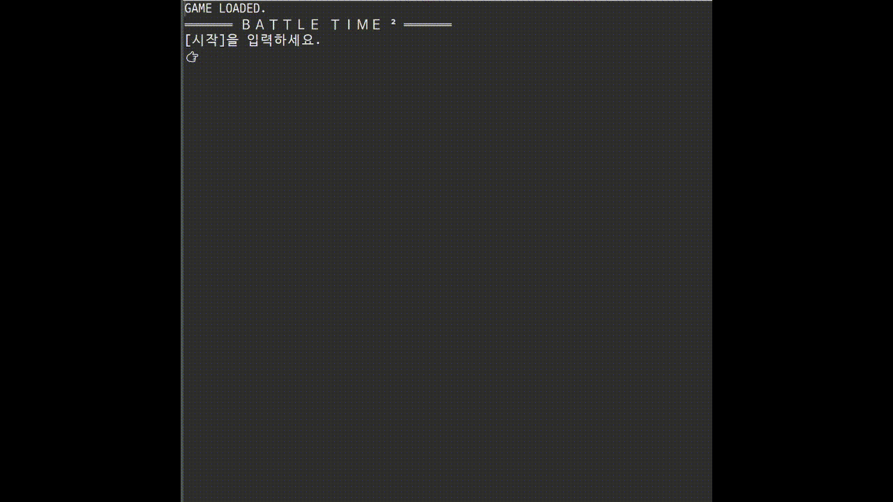
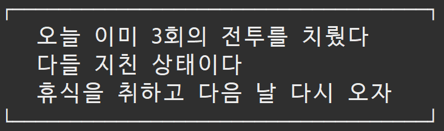

# BattleTime2

> 게임 소개

**함께 성장하는 길드 전투**

 
 

> 게임 설명

▼ 직업 
1. ⚔️전사
   - 높은 공격력과 방어력, HP를 갖고 있습니다.
   - 한 마리의 몬스터를 강하게 공격하는 스킬을 보유하고 있습니다.
   - 스킬: **<<죽음의 일격>>** 한 마리의 몬스터에게 공격력 2배의 피해를 입힙니다.  
2. 🧙🏻‍♂️마법사
   - 평균의 공격력과 방어력, HP를 갖고 있습니다.
   - 다수의 적을 공격하는 스킬을 보유하고 있습니다.
   - 스킬: **<<마법의 태풍>>** 모든 몬스터에게 공격력 1/2의 피해를 입힙니다.
3. 🏹궁수
   - 평균의 공격력과 HP, 비교적 낮은 방어력을 갖고 있습니다.
   - 방어력을 무시하고 다수의 적을 공격하는 스킬을 보유하고 있습니다.
   - 스킬: **<<파괴의 화살>>** 한마리의 몬스터에게 100퍼센트의 피해를 입히고, 나머지 몬스터에게 공격력 1/2의 피해를 입힙니다(방어력 무시).
4. ❤️‍🩹힐러
   - 낮은 공격력과 방어력, HP를 갖고 있습니다.
   - 아군들을 치료하는 스킬을 보유하고 있습니다.
   - 스킬: **<<안정의 선율>>** 길드원 모두가 각자의 최대체력의 50퍼센트를 회복합니다.

▼ 길드 
- 정원은 10명입니다.
- **3명으로 이루어진 파티**를 구성해 배틀에 참여할 수 있습니다.
- 불법 행위를 하는 길드원을 추방할 수 있습니다.
 

▼ 몬스터 
- 세 종류(박쥐, 오크, 트롤)의 몬스터가 존재합니다.
- 하루가 지날수록 점점 더 강해집니다.
 

▼ 본 게임은 다음과 같은 스테이지를 제공합니다 
┌────────┐ 
│ 🏠 아지트　│ 
│ 🏪 상점　　│ 
│ ⚔️ 전투　　│ 
│ 📜 저장　　│ 
│ 🔚 종료　　│ 
└────────┘ 
 

▼ 본 게임은 다음과 같은 기능을 제공합니다 
1. 👨‍👩‍👧‍👦 길드
   - 3명으로 이루어진 파티를 자유롭게 구성할 수 있습니다.
   - 최대 10명의 길드원을 모집할 수 있습니다.
   - 불법 행위를 하는 길드원을 추방할 수 있습니다.
2. 🏠아지트
    1. 창고
        * 보유한 아이템을 확인할 수 있습니다.
        * 아이템을 장착하고 해제할 수 있습니다.
        * 이름순으로 정렬하는 기능을 제공합니다.
    2. 취침 
        * 모든 길드원의 체력과 스킬포인트가 회복됩니다.
        * 전투 패배 후 이용 시, 재전투가 가능합니다.
    3. 지갑 
        * 보유 코인을 확인할 수 있습니다.
3. 🏪 상점
    1. 물약
       * 종류: HP(💰100), SP(💰200)
       * 매일 랜덤으로 종류별 0~2개의 물약이 들어옵니다.
    2. 무기
       * 종류: 초급(💰300)(🗡️20%), 중(💰600)(🗡️30%), 고급(💰1000)(🗡️50%)
       * 구매 전, 정보를 확인할 수 있습니다.
    3. 갑옷
       * 종류: 초급(💰200)(🛡️30%), 중(💰500)(🛡️50%), 고급(💰900)(🛡️80%)
       * 구매 전, 정보를 확인할 수 있습니다.
     
    * 모든 아이템은 길드가 보유하고 있는 코인 내에서 구매가 가능합니다.
4. ⚔️ 전투
    * **3명으로 이루어진 파티** 구성 후, 참여 가능합니다.
    * 하루에 **3번** 입장할 수 있습니다.
    * 랜덤 몬스터 4마리가 출현합니다.
    * 길드원이 순서대로 랜덤의 몬스터를 공격합니다.
    * 길드원은 본인 차례에 보유 스킬 포인트 내에서 스킬을 사용할 수 있습니다.
    1. 승리
        * 랜덤 코인을 획득합니다.(강한 몬스터를 잡을수록 좋은 보상을 얻습니다)
        * **10퍼센트의 확률**로 스킬포인트가 영구적으로 1 증가합니다.
    2. 패배
        * 보유 코인의 절반 ~ 전체를 빼앗깁니다.
        * 아지트로 이동합니다. **(취침으로 회복 시 재배틀 가능)**
5. 📜 저장
    * 저장하지 않고 종료 시, 해당 날짜의 게임 데이터는 사라집니다.
    * 플레이 없는 무분별한 저장과 재실행은 몬스터만 강해지게 할 뿐입니다.
6. 🔚 종료
    * 종료 시, 친절하게 저장 여부를 묻습니다.
    * 저장하지 않고 종료 시, 해당 날짜의 게임 데이터는 사라집니다.

 

> Class Diagram (UML)
### Stage

### Unit

### Item

 
 

> Demo
## 1일차
**게임 시작, 파티 등록과 배틀**

 
 

## 2일차
**상점 이용(무기 구매), 장착 후 배틀 참여**

 
 
#### ▼ 10퍼센트의 확률로 스킬포인트가 영구적으로 1 증가합니다.

 
 

## 3일차
**상점 이용(포션 구매), 포션 사용**

 
 

## 패배
**전투, 취침**

 
 
#### ▼ 3번의 전투가 끝난 후에는 재전투가 불가능합니다.

